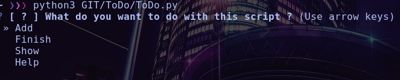

# To Do List Manager

This little script can help you to have a better manager of To Do list for some bug and other error without mark it down on paper.

To use this script, you need the ToDo.py file and launch it with the following command:

```sh
python3 ToDo.py
```

# Install

For linux and linux only there is a little script in the Git repo, just exectute by : ```$ ./path/ToDo/Install.sh```.

For Macos i thinks it's pretty the same thing and i'm currently working on a version for windows.

# Image

## Menu


## Show task


## Add task


## Finish task
