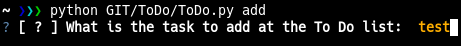

# To Do List Manager

This little script can help you to have a better manager of To Do list for some bug and other error without mark it down on paper.

## Dependence

The single dependence is the "menu" for add and select the finished task and it's installable with pip by: 
```sh
pip3 install questionary
```
or
```sh
pip3 install -r requirement.txt
```

To use this script, you need the ToDo.py file and launch it with the following command:
```sh
python3 ToDo.py
```

:warning: I've try to make it in one file ( and I'm pretty happy with it ). :warning:

# Image

## Help


## Show task


## Add task


## Remove task


## Finish task

